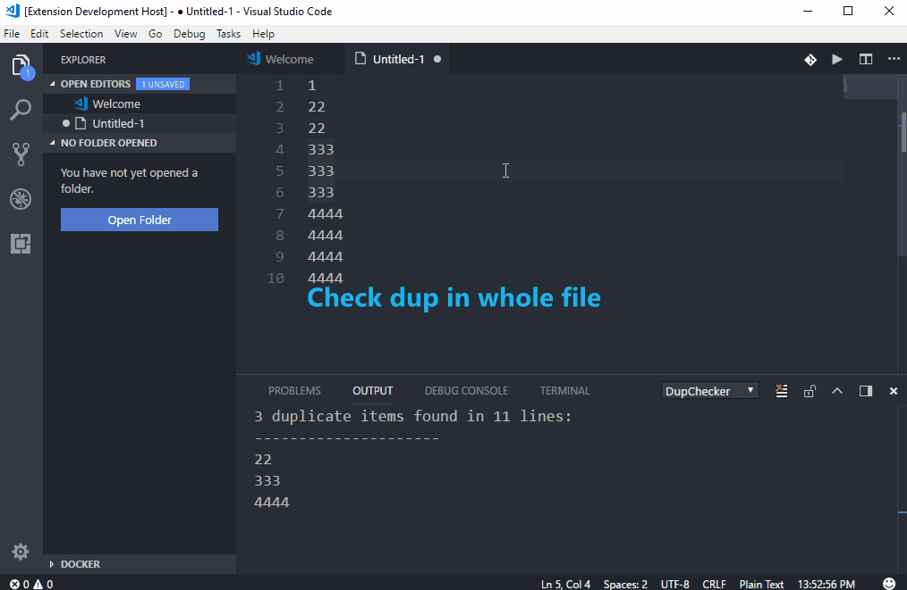
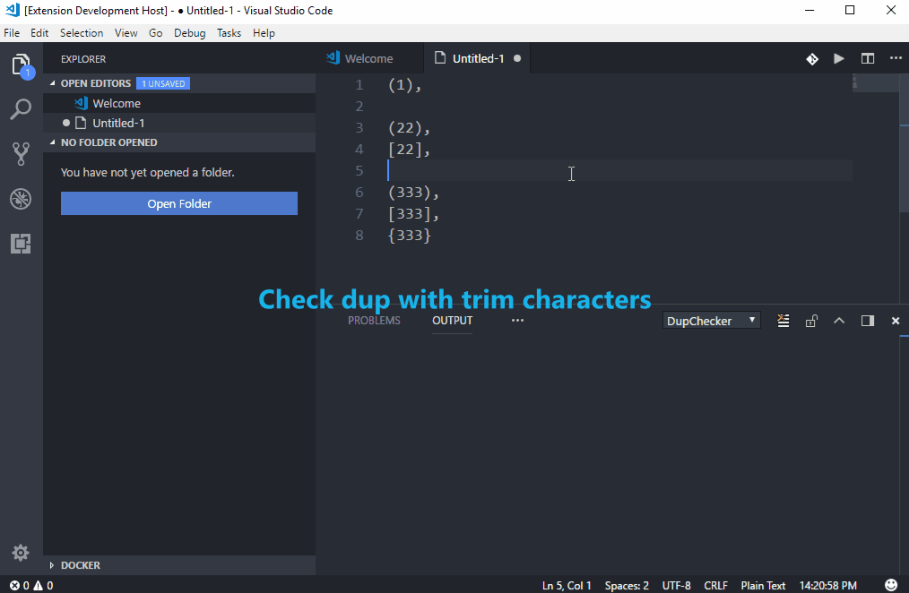
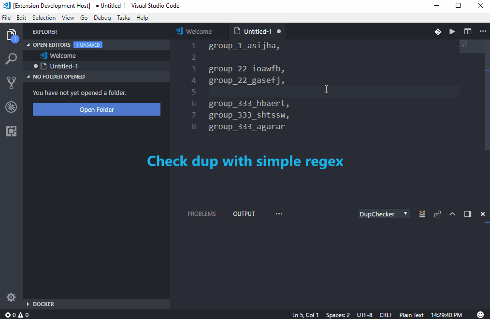

# DupChecker

## Features

**Check duplicate lines** in the file content or selection, and **remove them** if you need to keep the unique lines only.

### Multiple Check Modes
Commands:
- `Check Duplicates`: check duplicate lines immediately.
- `Check Duplicates With Trim Condition`: trim customer input characters first (on both start and end).
- `Check Duplicates With Regex Match`: capture matched substrings with customer input regex first (DupChecker will use the **last match** if you have multiple groups in regex).

### Configurations:
```
"dupchecker": {
  "trimStart": true,      // trim starting whitespaces in each line, default: true
  "trimEnd": true,        // trim ending whitespaces in each line, default: true
  "ignoreCase": false,    // ignore case when comparing lines, default: false
  "leaveEmptyLine": true  // leave an empty line after removing duplicates if true, or delete whole line if false, default: true
}
```

## Use Case

### Check Duplicates


### Check Duplicates With Trim Condition


### Check Duplicates With Regex Match

