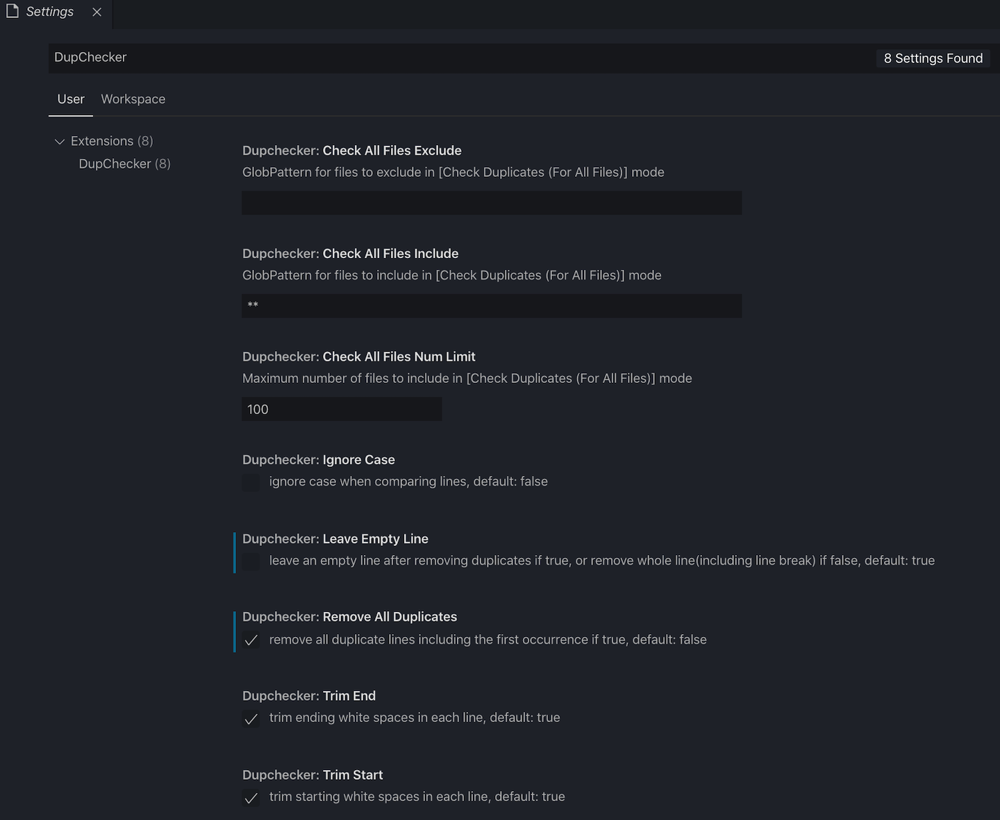

# DupChecker

## Features

**Check duplicate lines** in the file content or selection, and **remove them** if you need to keep the unique lines only.

🆕Since v0.1.0, DupChecker uses [cuckoo-filter](https://github.com/vijayee/cuckoo-filter) to speed up checking progress, and be able to handle large files with 100k+ lines.

❗️Note: for huge files with millions of lines, you may get an error like `Extension host terminated unexpectedly` which is caused by `JavaScript heap out of memory` exception, you'd better deal with the file outside vscode in this case.

### Multiple Check Modes
Commands:
- `Check Duplicates`: check duplicate lines immediately.
- `Check Duplicates With Trim Condition`: trim customer input characters first (on both start and end).
- `Check Duplicates With Regex Match`: capture matched substrings with customer input regex first (DupChecker will use the **last match** if you have multiple groups in regex).

### Configurations:

In **Preferences -> settings**:


Or in `settings.json`:
```
"dupchecker": {
  "trimStart": true,            // trim starting whitespaces in each line, default: true
  "trimEnd": true,              // trim ending whitespaces in each line, default: true
  "ignoreCase": false,          // ignore case when comparing lines, default: false
  "leaveEmptyLine": true,       // leave an empty line after removing duplicates if true, or remove whole line(including line break) if false, default: true
  "removeAllDuplicates": false  // remove all duplicate lines including the first occurrence if true, default: false
}
```

## Use Case

### Check Duplicates


### Check Duplicates With Trim Condition


### Check Duplicates With Regex Match

